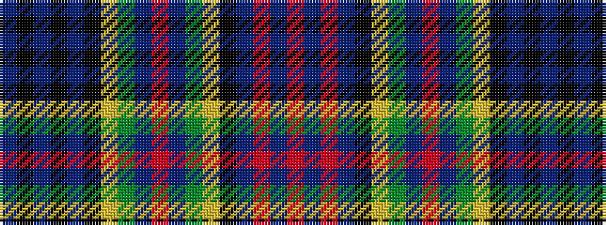

BKBKBKYGBRBGYKBRBR

It is a 18 stripe tartan.

<figure class="pat-woven">

<figcaption>idealised sample</figcaption>
</figure>

## Colour Sequence



## Tartans with this colour sequence

| Tartans |
|---------------|
| [Graham of Airth](/variants/s18/dp6k2dp6k12dp3k13ly2dg18dp3r3dp3dg18ly2k13dp15r5dp3r5~x2/)|
||
