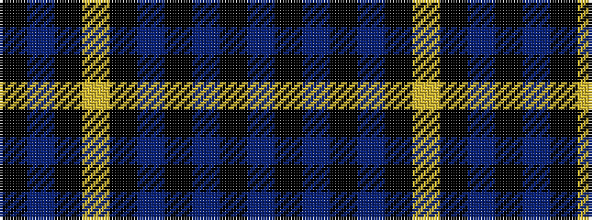

BKBKBKYKBK

It is a 10 stripe tartan.

<figure class="pat-woven">

<figcaption>idealised sample</figcaption>
</figure>

## Colour Sequence



## Tartans with this colour sequence

| Tartans |
|---------------|
| [City Building (Glasgow) LLP](/setts/s10/k3n6k8lr2k8n3k5n36k2n3~x2/)|
||
