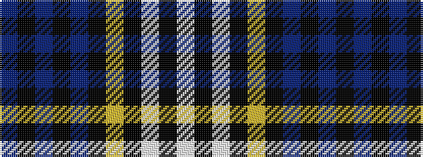

BKBKBKYKWKW

It is a 11 stripe tartan.

<figure class="pat-woven">

<figcaption>idealised sample</figcaption>
</figure>

## Colour Sequence



## Tartans with this colour sequence

| Tartans |
|---------------|
| [Kang (Personal)](/variants/s11/db44k3db3k3db3k14ly4k3w2k2w2~x2/)|
||
