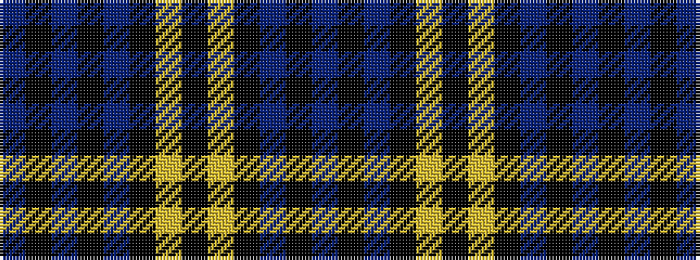

BKBKBKYKYKBKB

It is a 13 stripe tartan.

<figure class="pat-woven">

<figcaption>idealised sample</figcaption>
</figure>

## Colour Sequence



## Tartans with this colour sequence

| Tartans |
|---------------|
| [Gordon (Clan)](/variants/s13/db23k3db3k3db3k17ly22k4ly22k17db22k3db3~x2/)|
||
