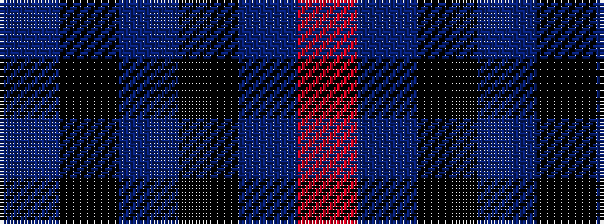

BKBKBR

It is a 6 stripe tartan.

<figure class="pat-woven">

<figcaption>idealised sample</figcaption>
</figure>

## Colour Sequence



## Tartans with this colour sequence

| Tartans |
|---------------|
| [Largan (?)](/variants/s6/db8k39db8k39db87r6/)|
||
| [MacCorquodale #2](/variants/s6/r8b32k24db24k3b3~x2/)|
||
| [MacKay V](/variants/s6/db2k6db2k6db16r1~x2/)|
||
| [Mackay (Blue)](/variants/s6/n1k3n1k3n8r1~x8/)|
||
| [Morgan (MacKay Blue) Clan Tartan](/variants/s6/db1k3db1k3db8r1~x4/)|
||
| [Norsemen, The](/variants/s6/n65ki2n4k2n10r24~x2/)|
||
