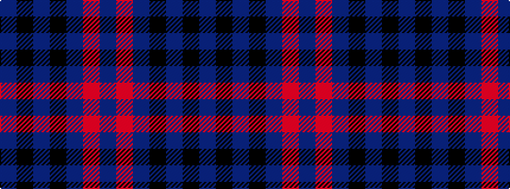

BKBKBRB

It is a 7 stripe tartan.

<figure class="pat-woven">

<figcaption>idealised sample</figcaption>
</figure>

## Colour Sequence



## Tartans with this colour sequence

| Tartans |
|---------------|
| [Korner-MacPherson (Personal)](/variants/s7/n5r3n35k28n4k11n2~x2/)|
||
