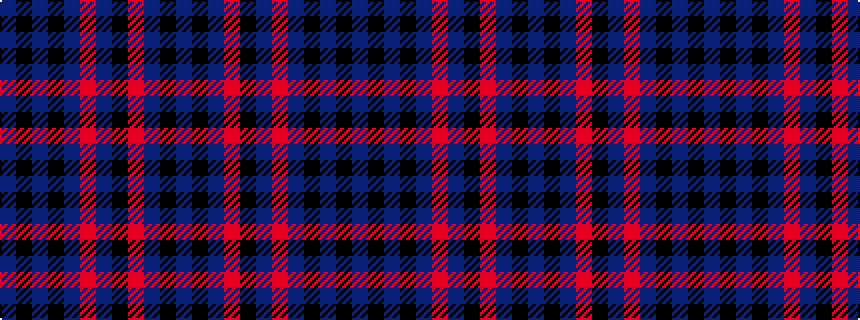

BKBKBRBKRBKB

It is a 12 stripe tartan.

<figure class="pat-woven">

<figcaption>idealised sample</figcaption>
</figure>

## Colour Sequence



## Tartans with this colour sequence

| Tartans |
|---------------|
| [Balmoral (Pendleton)](/variants/s12/n3k2n19r3k1n3r4n3k1n2k1n2~x4/)|
||
