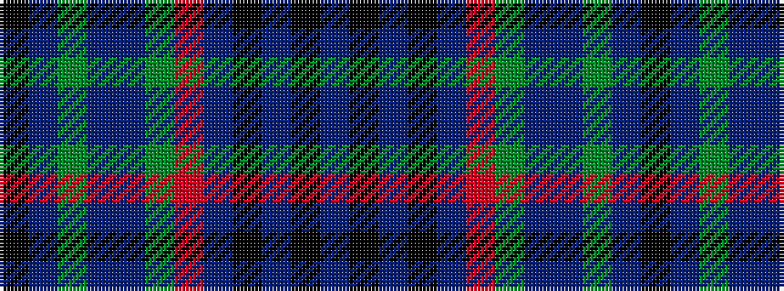

BKBKBRGBBGBK

It is a 12 stripe tartan.

<figure class="pat-woven">

<figcaption>idealised sample</figcaption>
</figure>

## Colour Sequence



## Tartans with this colour sequence

| Tartans |
|---------------|
| [Kelvin Family (Personal)](/variants/s12/db9k2db4k2dr6o3dy2db2dr11dy23t1k8~x2/)|
||
