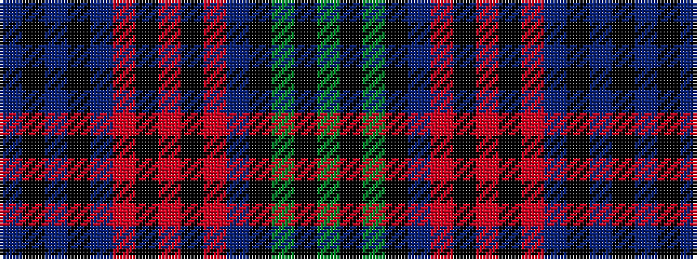

BKBKBRKRKRBKGKG

It is a 15 stripe tartan.

<figure class="pat-woven">

<figcaption>idealised sample</figcaption>
</figure>

## Colour Sequence



## Tartans with this colour sequence

| Tartans |
|---------------|
| [Doyel (Name)](/setts/s15/dg38k3dg3k3dt6o1k2r2k2o1dt6k3dt3k3dt19~x2/)|
||
