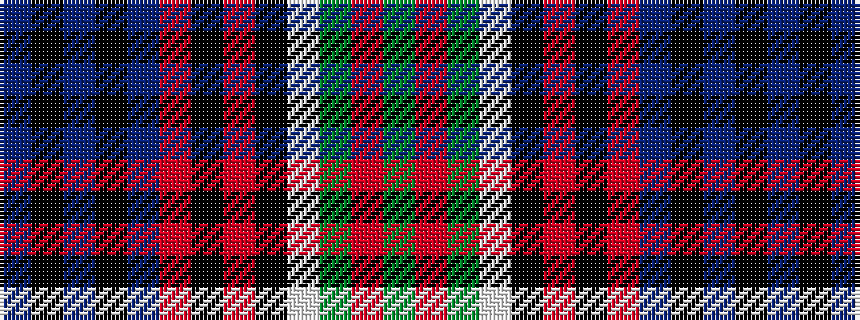

BKBKBRKRKWGRG

It is a 13 stripe tartan.

<figure class="pat-woven">

<figcaption>idealised sample</figcaption>
</figure>

## Colour Sequence



## Tartans with this colour sequence

| Tartans |
|---------------|
| [MacKusick (Piper) #1 (Personal)](/setts/s13/db4k1db2k1db6m2k4m2k8lb2g12m2g4~x2/)|
||
