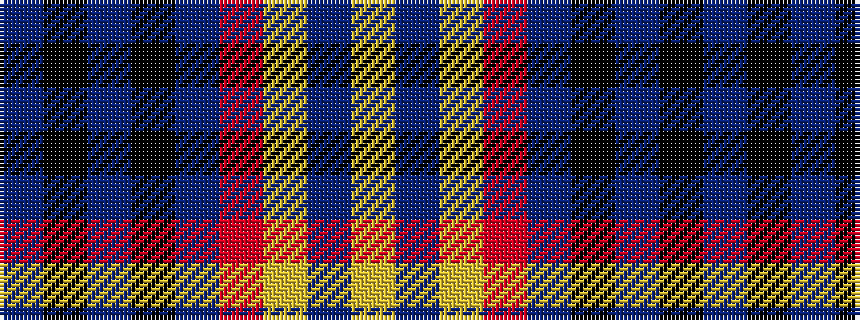

BKBKBRYBY

It is a 9 stripe tartan.

<figure class="pat-woven">

<figcaption>idealised sample</figcaption>
</figure>

## Colour Sequence



## Tartans with this colour sequence

| Tartans |
|---------------|
| [Unidentified 14](/setts/s9/db4k4db4k4db4r2lo3db4lo4~x3/)|
||
