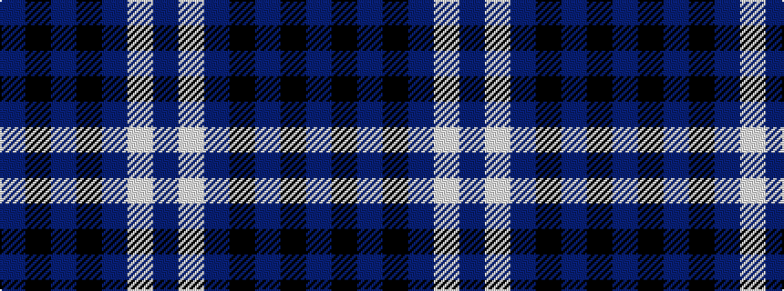

BKBKBWB

It is a 7 stripe tartan.

<figure class="pat-woven">

<figcaption>idealised sample</figcaption>
</figure>

## Colour Sequence



## Tartans with this colour sequence

| Tartans |
|---------------|
| [Argentina](/variants/s7/db5w3db33k3db3k36db3~x2/)|
||
| [Heritage of Scotland](/variants/s7/db6w3db21k16dp6k3dp6~x2/)|
||
