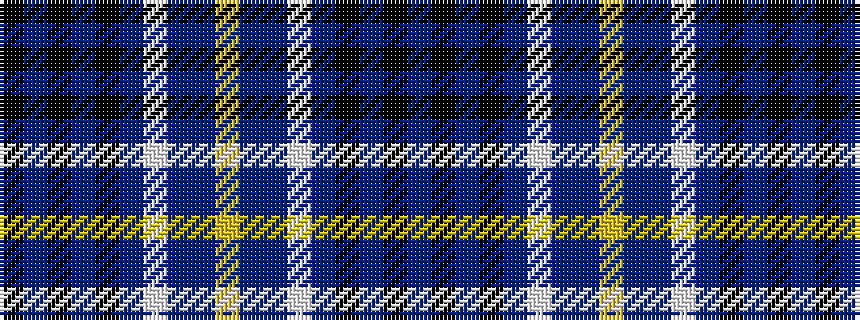

BKBKBWBBYBBWBKBKBK

It is a 18 stripe tartan.

<figure class="pat-woven">

<figcaption>idealised sample</figcaption>
</figure>

## Colour Sequence



## Tartans with this colour sequence

| Tartans |
|---------------|
| [Collister Personal Tartan](/variants/s18/k26n2k2n2k2n10w10n6dt10lo5~x2/)|
||
