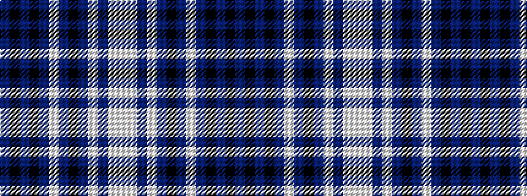

BKBKBWBKBWBWW

It is a 13 stripe tartan.

<figure class="pat-woven">

<figcaption>idealised sample</figcaption>
</figure>

## Colour Sequence



## Tartans with this colour sequence

| Tartans |
|---------------|
| [Life Goes on Foundation](/variants/s13/p12k4p5k4p32lb5p5k10p5lbi5p5lbi18w4/)|
||
