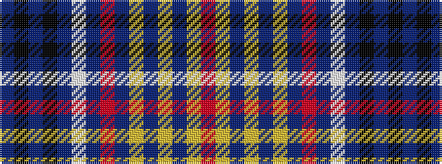

BKBKBWBRBYBYBYR

It is a 15 stripe tartan.

<figure class="pat-woven">

<figcaption>idealised sample</figcaption>
</figure>

## Colour Sequence



## Tartans with this colour sequence

| Tartans |
|---------------|
| [Laing (Clan)](/variants/s15/r1ly1b1ly3b1ly4b1r1b26w1b1k4b1k3b1~x4/)|
||
