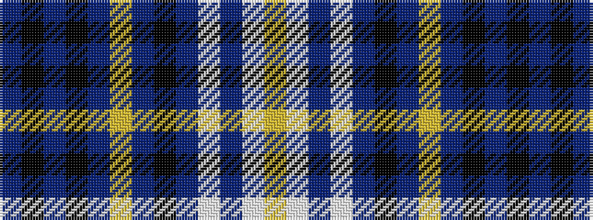

BKBKBYBKBWBWY

It is a 13 stripe tartan.

<figure class="pat-woven">

<figcaption>idealised sample</figcaption>
</figure>

## Colour Sequence



## Tartans with this colour sequence

| Tartans |
|---------------|
| [Life Goes On Foundation (Corporate)](/variants/s13/ly8lb17dp5lb5dp5k10dp5lr5dp32k5dp5k4dp6/)|
||
