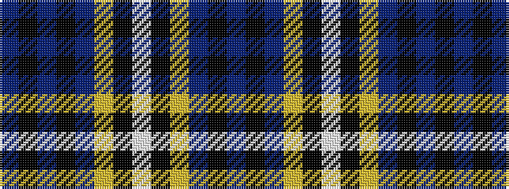

BKBKBYKWKYBKB

It is a 13 stripe tartan.

<figure class="pat-woven">

<figcaption>idealised sample</figcaption>
</figure>

## Colour Sequence



## Tartans with this colour sequence

| Tartans |
|---------------|
| [Kernbrownek (Personal)](/variants/s13/t7k1t1k1t1ly4k6w1k6ly4t5k1t1~x4/)|
||
