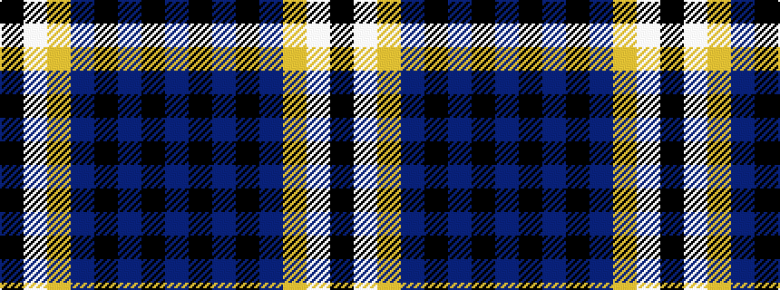

BKBKBYWK

It is a 8 stripe tartan.

<figure class="pat-woven">

<figcaption>idealised sample</figcaption>
</figure>

## Colour Sequence



## Tartans with this colour sequence

| Tartans |
|---------------|
| [Southern Lakes](/variants/s8/t32k2t4k2t8lo29w2k2/)|
||
