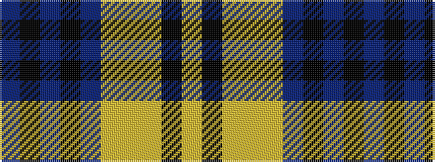

BKBKBYYYKY

It is a 10 stripe tartan.

<figure class="pat-woven">

<figcaption>idealised sample</figcaption>
</figure>

## Colour Sequence



## Tartans with this colour sequence

| Tartans |
|---------------|
| [Sonsub](/setts/s10/n30k5n19k5n2lr20ly2lr20k5ly4~x2/)|
||
