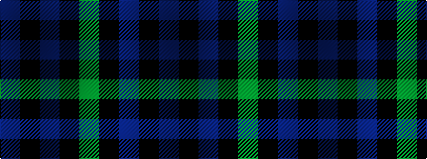

BKBKG

It is a 5 stripe tartan.

<figure class="pat-woven">

<figcaption>idealised sample</figcaption>
</figure>

## Colour Sequence



## Tartans with this colour sequence

| Tartans |
|---------------|
| [Campbell of Glenlyon](/tartans/g7k6b7k1b2/)|
||
| [Campbell of Glenlyon](/setts/s5/g7k6db7k1db2~x2/)|
||
