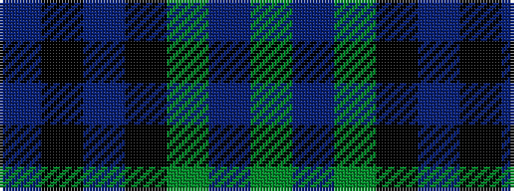

BKBKGBG

It is a 7 stripe tartan.

<figure class="pat-woven">

<figcaption>idealised sample</figcaption>
</figure>

## Colour Sequence



## Tartans with this colour sequence

| Tartans |
|---------------|
| [Unnamed 19th Century Plaid](/setts/s7/g8t1g1k6dp6k1dp3~x4/)|
||
