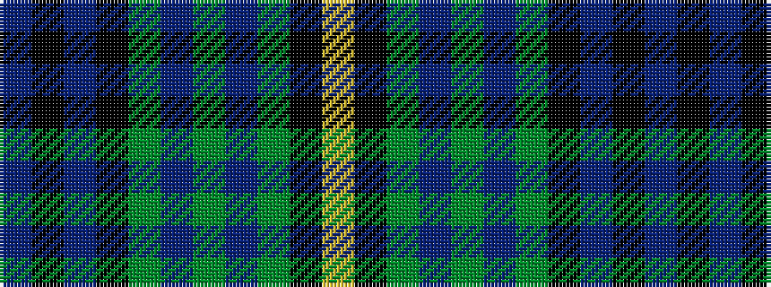

BKBKGBGBGKY

It is a 11 stripe tartan.

<figure class="pat-woven">

<figcaption>idealised sample</figcaption>
</figure>

## Colour Sequence



## Tartans with this colour sequence

| Tartans |
|---------------|
| [Forth](/variants/s11/db4k3db23k9g2t2g2t2g8k2ly3~x2/)|
||
