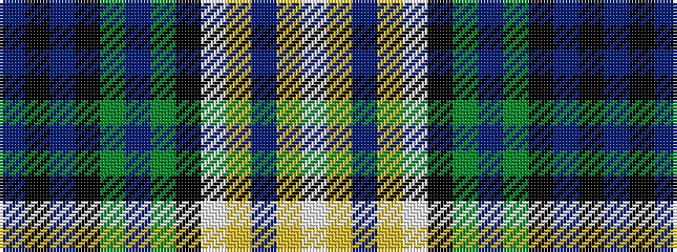

BKBKGBGKWYBYW

It is a 13 stripe tartan.

<figure class="pat-woven">

<figcaption>idealised sample</figcaption>
</figure>

## Colour Sequence



## Tartans with this colour sequence

| Tartans |
|---------------|
| [North of Scotland Tartan Army](/setts/s13/dp3k3dp10k11g14db3g14k11w3lr3db15lr2w2~x2/)|
||
