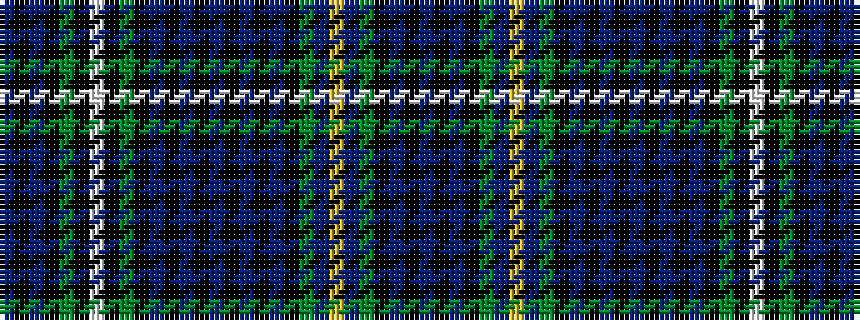

BKBKGBYBGKBKBKBKBKBKGKWKGKBKB

It is a 29 stripe tartan.

<figure class="pat-woven">

<figcaption>idealised sample</figcaption>
</figure>

## Colour Sequence



## Tartans with this colour sequence

| Tartans |
|---------------|
| [Campbell Argyll](/setts/s29/db1k1db8k8dg8k1lb2k1dg8k8db1k1db1k1db8k1db1k1db1k8dg8db1ly2db1dg8k8db8k1db1/)|
||
