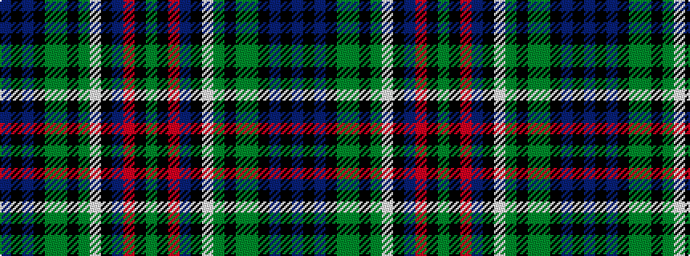

BKBKGGKGWKBRKG

It is a 14 stripe tartan.

<figure class="pat-woven">

<figcaption>idealised sample</figcaption>
</figure>

## Colour Sequence



## Tartans with this colour sequence

This pattern is a design lineage: every tartan below shares one colour order, whatever its owner —
near-identical designs are grouped, the largest lineage first (#112: the pattern is a tartan's
second parent, beside its family or clan).

<table class="sett-table">
<tbody>
<tr><td><a href="/variants/s14/dy2k3r6db4k17w2g16k2g16dy2k15dbi16k2dbi2~x2~db1106275-dbi1406275/">Allison (MacGregor-Hastie)</a></td></tr>
<tr><td class="sett-swatch"></td></tr>
<tr class="cluster-sep"><td></td></tr>
<tr><td><a href="/variants/s14/db3k3db15k15y3dg15k3dg15w3k15dbi4r6k3y2~x2~db1204274-dbi1406275/">Allison Family Tartan</a></td></tr>
<tr><td class="sett-swatch"></td></tr>
</tbody>
</table>

