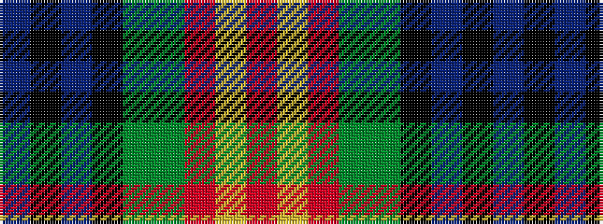

BKBKGGRYR

It is a 9 stripe tartan.

<figure class="pat-woven">

<figcaption>idealised sample</figcaption>
</figure>

## Colour Sequence



## Tartans with this colour sequence

| Tartans |
|---------------|
| [Cumming LO](/variants/s9/r4lr1r4dg10y1k10b4k2b4~x2/)|
||
