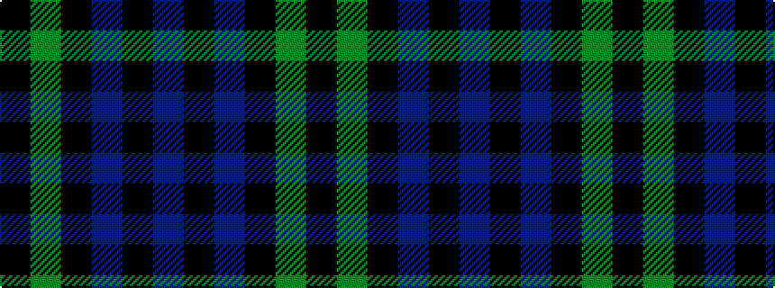

BKBKGK

It is a 6 stripe tartan.

<figure class="pat-woven">

<figcaption>idealised sample</figcaption>
</figure>

## Colour Sequence



## Tartans with this colour sequence

This pattern is a design lineage: every tartan below shares one colour order, whatever its owner —
near-identical designs are grouped, the largest lineage first (#112: the pattern is a tartan's
second parent, beside its family or clan).

<table class="sett-table">
<tbody>
<tr><td><a href="/variants/s6/k1dg6k6db6k1db1~x4~dg1605139-db1004274/">Black Watch (smallest sett)</a></td></tr>
<tr><td class="sett-swatch"></td></tr>
<tr><td><a href="/variants/s6/k5g23k18db21k33db3~x2/">Black Watch (variation)</a></td></tr>
<tr><td class="sett-swatch"></td></tr>
<tr><td><a href="/variants/s6/t6k6t18k18g22k5~x2/">Campbell, The 42nd</a></td></tr>
<tr><td class="sett-swatch"></td></tr>
<tr><td><a href="/variants/s6/db6k6db18k18g22k5/">Campbell, the 42nd</a></td></tr>
<tr><td class="sett-swatch"></td></tr>
<tr><td><a href="/variants/s6/k1g3k3db3k1db1~x4/">Sutherland 42nd</a></td></tr>
<tr><td class="sett-swatch"></td></tr>
<tr><td><a href="/variants/s6/db4k2db16k10g18k3~x2/">Wartley Htg (Fashion)</a></td></tr>
<tr><td class="sett-swatch"></td></tr>
<tr class="cluster-sep"><td></td></tr>
<tr><td><a href="/variants/s6/k3g13k10dr13k2dr3~x2/">MacCormick (Dress)</a></td></tr>
<tr><td class="sett-swatch"></td></tr>
<tr class="cluster-sep"><td></td></tr>
<tr><td><a href="/variants/s6/db19k4dr1k4dg9k1~x4/">Monarchs Corporate Sport Tartan</a></td></tr>
<tr><td class="sett-swatch"></td></tr>
<tr class="cluster-sep"><td></td></tr>
<tr><td><a href="/variants/s6/k4y1k20t20k1t4~x4/">Oakleigh (Corporate)</a></td></tr>
<tr><td class="sett-swatch"></td></tr>
</tbody>
</table>

