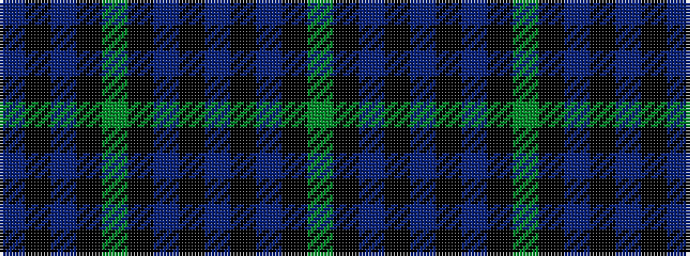

BKBKGKBKBKBKG

It is a 13 stripe tartan.

<figure class="pat-woven">

<figcaption>idealised sample</figcaption>
</figure>

## Colour Sequence



## Tartans with this colour sequence

| Tartans |
|---------------|
| [Davies (Welsh Name)](/setts/s13/g2k3db30k2db4k2db30k3g30k3db30k2t2/)|
||
