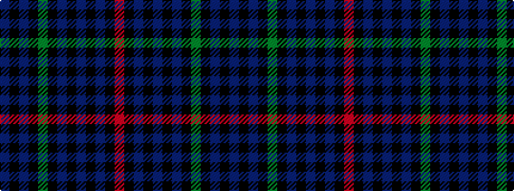

BKBKGKBKBKBKR

It is a 13 stripe tartan.

<figure class="pat-woven">

<figcaption>idealised sample</figcaption>
</figure>

## Colour Sequence



## Tartans with this colour sequence

| Tartans |
|---------------|
| [Braid (Estimated threadcount)](/variants/s13/db13k3db5k6g18k2dp9k2db3k2dp11k4r4~x2/)|
||
