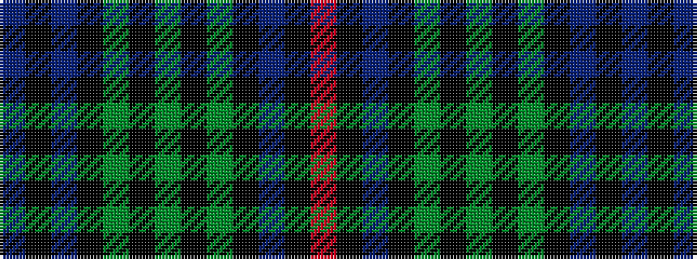

BKBKGKGKGKBKR

It is a 13 stripe tartan.

<figure class="pat-woven">

<figcaption>idealised sample</figcaption>
</figure>

## Colour Sequence



## Tartans with this colour sequence

| Tartans |
|---------------|
| [Unidentified #10](/setts/s13/r3k2db10k10dg12k8dg12k10dg2k10db2k2db2/)|
||
| [Unnamed 5](/setts/s13/r3k2db10k10g12k8g12k10g2k10db2k2db2/)|
||
