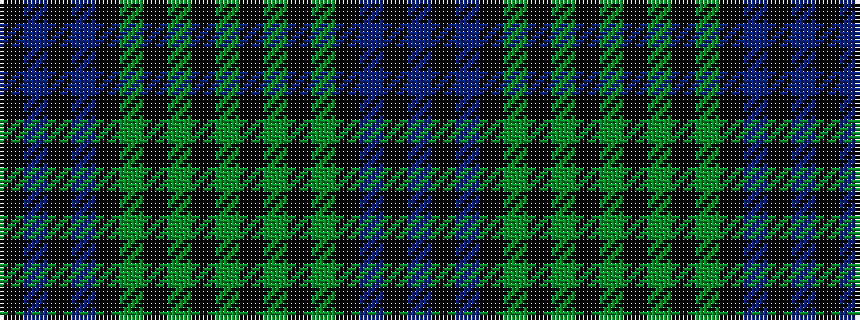

BKBKGKGKGKGKGKBKBK

It is a 18 stripe tartan.

<figure class="pat-woven">

<figcaption>idealised sample</figcaption>
</figure>

## Colour Sequence



## Tartans with this colour sequence

| Tartans |
|---------------|
| [Kerr Hunting](/setts/s18/g16k2g2k2g4k10b19k2b2k3~x2/)|
||
