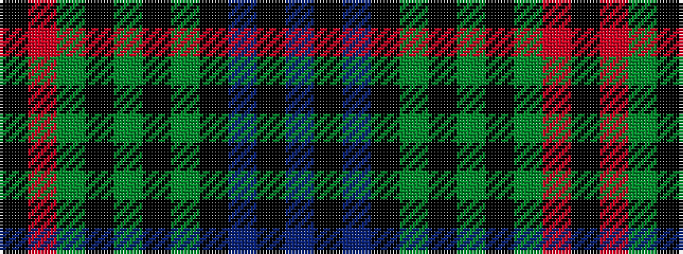

BKBKGKGKGRK

It is a 11 stripe tartan.

<figure class="pat-woven">

<figcaption>idealised sample</figcaption>
</figure>

## Colour Sequence



## Tartans with this colour sequence

| Tartans |
|---------------|
| [Louise](/variants/s11/k1r1g6k1g1k1g1k6db9k1db1~x2/)|
||
| [Louise of Lorne](/variants/s11/k1r1dg6k1dg1k1dg1k6db9k1db1~x2/)|
||
