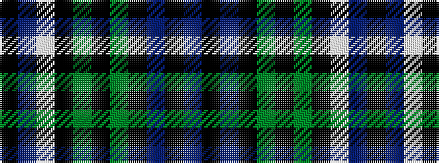

BKBKGKGKWBK

It is a 11 stripe tartan.

<figure class="pat-woven">

<figcaption>idealised sample</figcaption>
</figure>

## Colour Sequence



## Tartans with this colour sequence

| Tartans |
|---------------|
| [Wacker](/setts/s11/db12k6db6k25dg25k2dg25k25w2db6k6/)|
||
