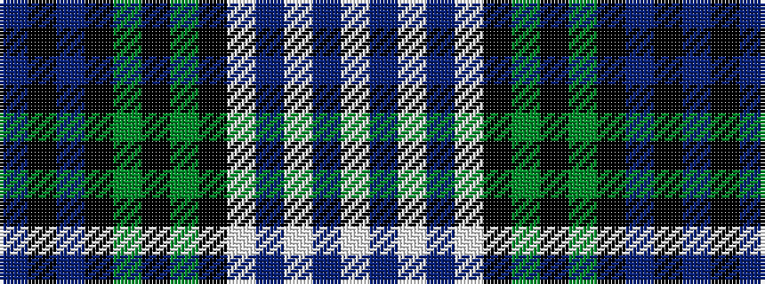

BKBKGKGKWBWBW

It is a 13 stripe tartan.

<figure class="pat-woven">

<figcaption>idealised sample</figcaption>
</figure>

## Colour Sequence



## Tartans with this colour sequence

| Tartans |
|---------------|
| [Black Watch Dress (Fashion)](/setts/s13/db1k1db3k3dg4k1dg4k3lb1db1lb6db1lb1~x4/)|
||
| [Black Watch Dress (Symmetrical)](/setts/s13/db1k1db3k3g4k1g4k3w1db1w6db1w1~x4/)|
||
| [Sutherland, dress](/setts/s13/db6k5db10k10g13k3g13k10w4db4w18db2w3~x2/)|
||
