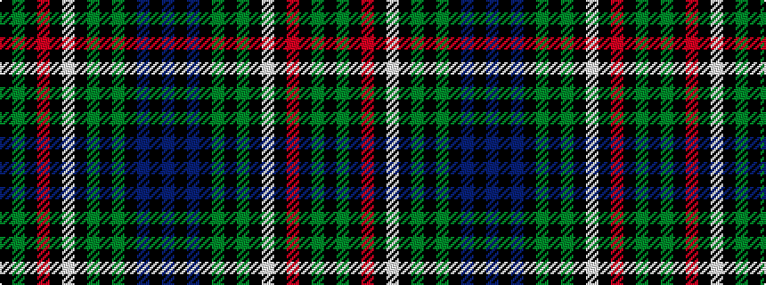

BKBKGKGKWKRKGK

It is a 14 stripe tartan.

<figure class="pat-woven">

<figcaption>idealised sample</figcaption>
</figure>

## Colour Sequence



## Tartans with this colour sequence

| Tartans |
|---------------|
| [Irish Diaspora](/setts/s14/b14k3b14k10gi40k1g3k1w3k1o3k1gi40k10~x2/)|
||
