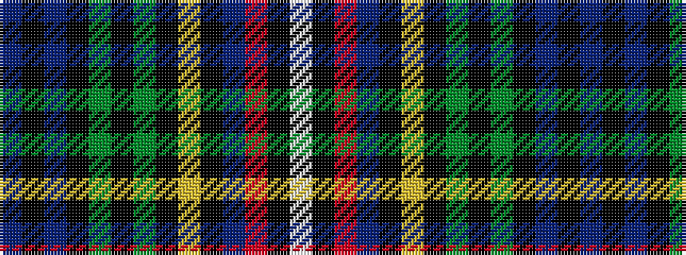

BKBKGKGKYKBRKW

It is a 14 stripe tartan.

<figure class="pat-woven">

<figcaption>idealised sample</figcaption>
</figure>

## Colour Sequence



## Tartans with this colour sequence

| Tartans |
|---------------|
| [Alison / Allison](/setts/s14/db3k3db12k18dg14k2dg14k8ly2k8t4r4k2w3~x2/)|
||
| [Alison / Allison](/setts/s14/db3k3db12k18g14k2g14k8ly2k8t4r4k2w3~x2/)|
||
| [Allison (MacBean and Bishop)](/setts/s14/db3k2db12k18dg14k2dg14k8ly2k8t4r4k2w3~x2/)|
||
