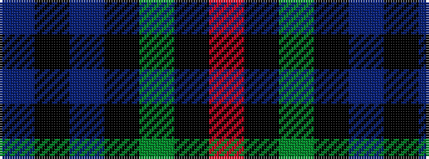

BKBKGKR

It is a 7 stripe tartan.

<figure class="pat-woven">

<figcaption>idealised sample</figcaption>
</figure>

## Colour Sequence



## Tartans with this colour sequence

| Tartans |
|---------------|
| [MacKinlay (Clan)](/setts/s7/db4k2db10k10g10k2r3~x2/)|
||
| [Renfrew](/setts/s7/db6k2db18k18g18k3r2~x2/)|
||
