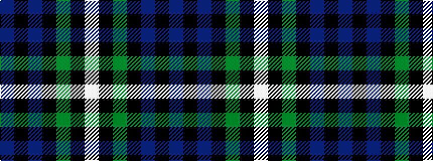

BKBKGKW

It is a 7 stripe tartan.

<figure class="pat-woven">

<figcaption>idealised sample</figcaption>
</figure>

## Colour Sequence



## Tartans with this colour sequence

| Tartans |
|---------------|
| [Baillie](/variants/s7/p3k1p8k6g8k1w2~x2/)|
||
| [Baillie (Highland Society)](/variants/s7/dp3k1dp8k6dg8k1w2~x2/)|
||
| [Forbes](/variants/s7/db1k1db6k6g6k1w1~x2/)|
||
| [Forbes #4](/variants/s7/db1k1db6k6dg6k1w1~x2/)|
||
| [Forbes Ancient](/setts/db1k6db6k6g6k1w1/)|
||
| [Forbes LC](/variants/s7/db1k6db6k6dg6k1lb1/)|
||
