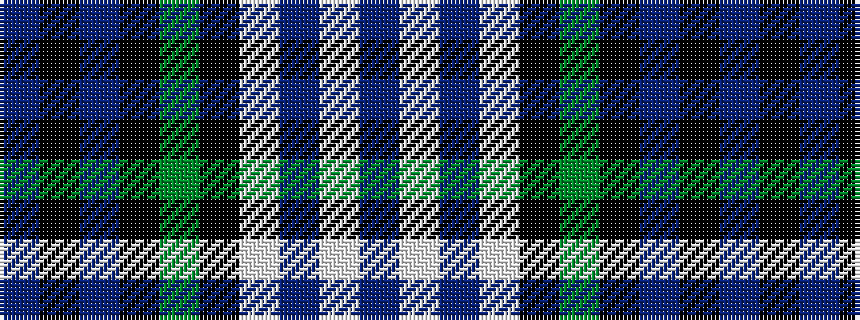

BKBKGKWBWB

It is a 10 stripe tartan.

<figure class="pat-woven">

<figcaption>idealised sample</figcaption>
</figure>

## Colour Sequence



## Tartans with this colour sequence

| Tartans |
|---------------|
| [Baird Dress](/setts/s10/db4k4db23k12g10k1w23dp2w2dp4~x2/)|
||
| [Baird, dress](/setts/s10/db4k4db23k12g10k1w23p2w2p4~x2/)|
||
