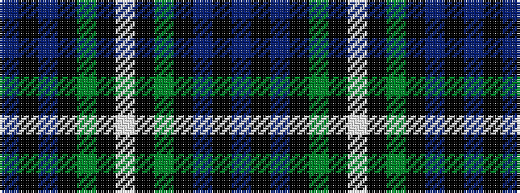

BKBKGKWKGKBKB

It is a 13 stripe tartan.

<figure class="pat-woven">

<figcaption>idealised sample</figcaption>
</figure>

## Colour Sequence



## Tartans with this colour sequence

| Tartans |
|---------------|
| [Forbes](/setts/s13/db1k1db6k6g6k1w1k1g6k6db6k1db1~x8/)|
||
