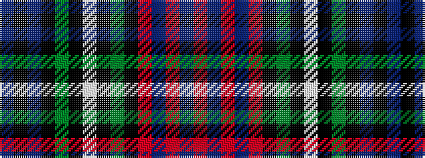

BKBKGKWKGKRBRBR

It is a 15 stripe tartan.

<figure class="pat-woven">

<figcaption>idealised sample</figcaption>
</figure>

## Colour Sequence



## Tartans with this colour sequence

| Tartans |
|---------------|
| [Unidentified - C20th](/setts/s15/db2k2db8k8g12k1w2k1g12k8r3t3r14t2r2~x2/)|
||
