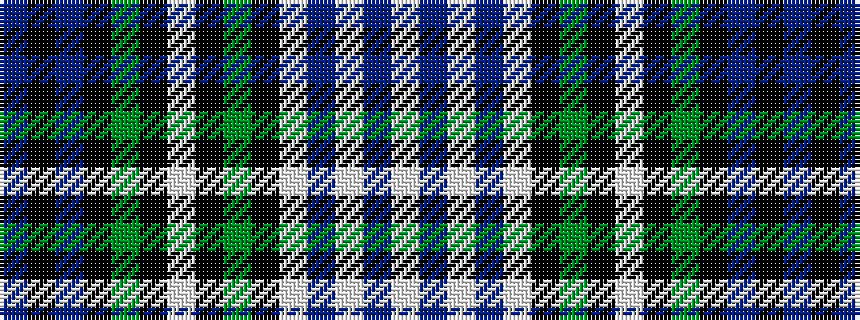

BKBKGKWKGKWBWBW

It is a 15 stripe tartan.

<figure class="pat-woven">

<figcaption>idealised sample</figcaption>
</figure>

## Colour Sequence



## Tartans with this colour sequence

| Tartans |
|---------------|
| [Forbes Dress](/variants/s15/db4k2db16k12dg16k2lb4k2dg16k12lb4db4lb16db2lb1~x2/)|
||
| [Forbes Dress](/variants/s15/db2k2db8k8g12k1w2k1g12k8w3db3w14db2w2~x2/)|
||
