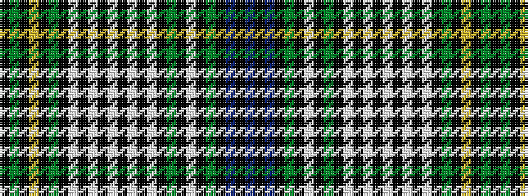

BKBKGKWKGKWKWKWKWKWKGKYKGK

It is a 26 stripe tartan.

<figure class="pat-woven">

<figcaption>idealised sample</figcaption>
</figure>

## Colour Sequence



## Tartans with this colour sequence

| Tartans |
|---------------|
| [Campbell](/setts/s26/k11g15k2ly3k2g15k11w5k5w19k2w5k2w19k5w5k11g15k2w3k2g15k11db11k3db11~x2/)|
||
| [Campbell #2](/setts/s26/k11dg15k2ly3k2dg15k11w5k5w19k2w5k2w19k5w5k11dg15k2w3k2dg15k11db11k3db11~x2/)|
||
