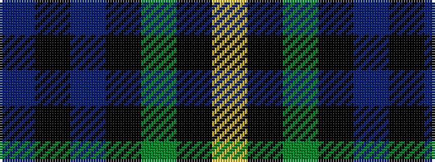

BKBKGKY

It is a 7 stripe tartan.

<figure class="pat-woven">

<figcaption>idealised sample</figcaption>
</figure>

## Colour Sequence



## Tartans with this colour sequence

| Tartans |
|---------------|
| [Forbes LC](/setts/s7/db1k6db6k6dg6k1lr1~x2/)|
||
| [Forbes LC](/setts/s7/db1k6db6k6dg6k1lr1/)|
||
