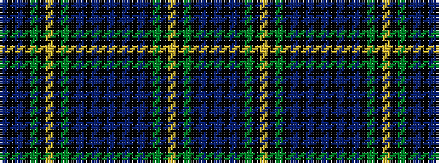

BKBKGKYKGKBKBKBKBKBKGKYKGKBKB

It is a 29 stripe tartan.

<figure class="pat-woven">

<figcaption>idealised sample</figcaption>
</figure>

## Colour Sequence



## Tartans with this colour sequence

| Tartans |
|---------------|
| [Campbell of Argyll](/setts/s29/db1k1db8k8dg8k1lr2k1dg8k8db1k1db1k1db8k1db1k1db1k8dg8k1ly2k1dg8k8db8k1db1~x2/)|
||
| [Campbell of Argyll](/setts/s29/db1k1db8k8dg8k1lr4k1dg8k8db1k1db1k1db16k1db1k1db1k8dg8k1ly4k1dg8k8db8k1db1/)|
||
