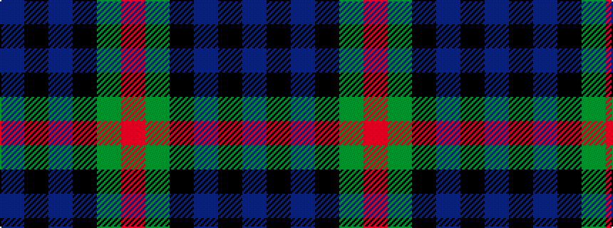

BKBKGR

It is a 6 stripe tartan.

<figure class="pat-woven">

<figcaption>idealised sample</figcaption>
</figure>

## Colour Sequence



## Tartans with this colour sequence

| Tartans |
|---------------|
| [Murray](/variants/s6/db2k2db12k8g11r2~x2/)|
||
| [Murray #3](/variants/s6/db2k2db12k8dg11r2~x2/)|
||
