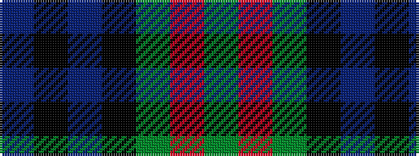

BKBKGRG

It is a 7 stripe tartan.

<figure class="pat-woven">

<figcaption>idealised sample</figcaption>
</figure>

## Colour Sequence



## Tartans with this colour sequence

| Tartans |
|---------------|
| [Inneryne (Personal)](/setts/s7/db4k4db16k14dg14m3dg3~x2/)|
||
| [Inneryne (Personal)](/setts/s7/db4k3db16k14g14r3g3~x2/)|
||
