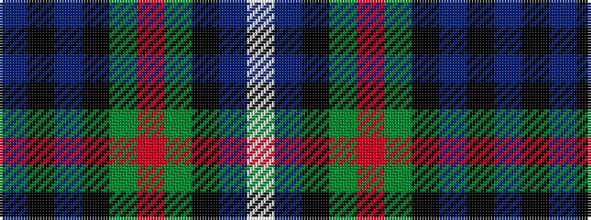

BKBKGRGKBW

It is a 10 stripe tartan.

<figure class="pat-woven">

<figcaption>idealised sample</figcaption>
</figure>

## Colour Sequence



## Tartans with this colour sequence

| Tartans |
|---------------|
| [Dalmeny](/setts/s10/db8k1db8k2g6r1g6k2db8w1~x2/)|
||
| [Dalmeny](/setts/s10/db8k1db8k2dg6r1dg6k2db8w1~x2/)|
||
| [Dalmeny - 1965 (Fashion)](/setts/s10/db8k1db8k2dg6r1dg6k2db8lb1~x2/)|
||
