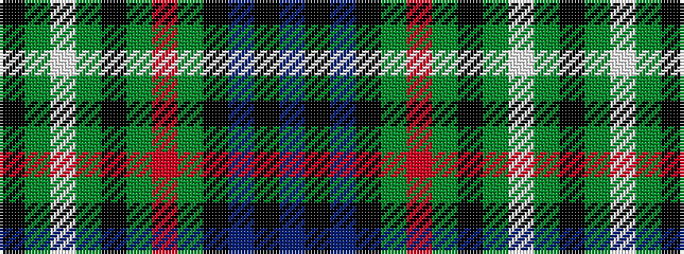

BKBKGRGKGWGK

It is a 12 stripe tartan.

<figure class="pat-woven">

<figcaption>idealised sample</figcaption>
</figure>

## Colour Sequence



## Tartans with this colour sequence

| Tartans |
|---------------|
| [Lloyd of Dolobran (Personal)](/setts/s12/k10g4w1g4k1g4r1g4k5db5k1db5~x4/)|
||
| [Lloyd of Dolobran Family Tartan Tartan Number: 1970. Earliest known date: 1930-50 This sample comes from the MacGregor-Hastie collection which forms the basis of the cloth archive of the Scottish Tartans Society. Some of the samples, including this one, were unmarked. One can assume that the sample dates between 1930 and 1950. See products available Copyright © Blair Urquhart, Comrie, 2015](/setts/s12/k5g4w1g4k1g4r1g4k5db5k1db5~x4/)|
||
