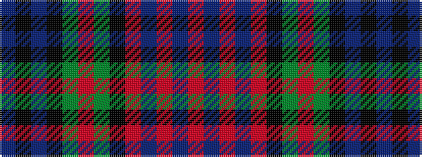

BKBKGRGKRBRBR

It is a 13 stripe tartan.

<figure class="pat-woven">

<figcaption>idealised sample</figcaption>
</figure>

## Colour Sequence



## Tartans with this colour sequence

| Tartans |
|---------------|
| [Murray of Atholl, Red Dress](/setts/s13/db4k1db5k4g8r4g8k4r3db3r12db2r4~x4/)|
||
| [Unidentified Sample #2](/setts/s13/r8db3r18db3r3k6g12r3g12k6db12k2db7~x2/)|
||
